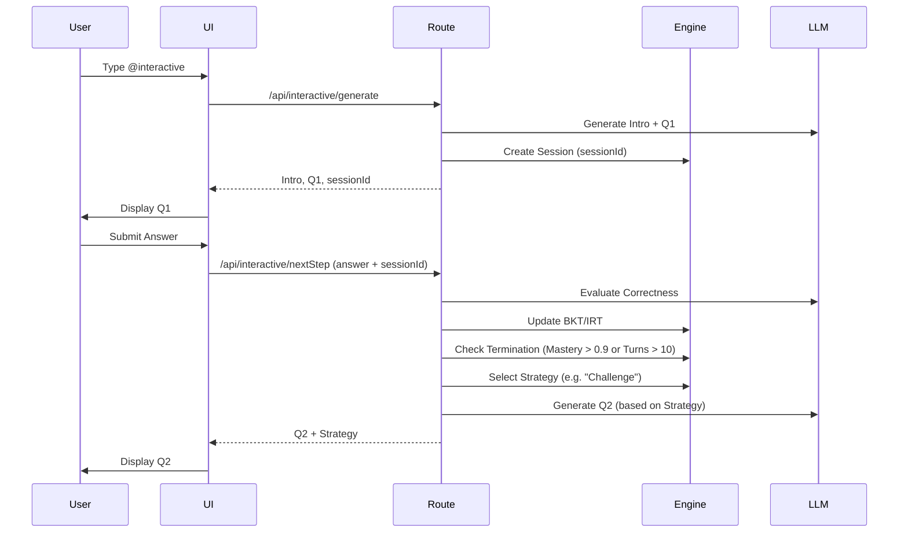

# Socratic Adaptive Learning Guide

This document provides a comprehensive technical and conceptual overview of the Luminal AI Adaptive Socratic Tutoring Engine.

---

## 📂 Related Files

### 1. Core Logic (`src/lib/tutoring/`)
- [bkt.js](file:///home/rafi/capstone/luminal/src/lib/tutoring/bkt.js): Bayesian Knowledge Tracing (mastery tracking).
- [irt.js](file:///home/rafi/capstone/luminal/src/lib/tutoring/irt.js): Item Response Theory (ability estimation).
- [informationGain.js](file:///home/rafi/capstone/luminal/src/lib/tutoring/informationGain.js): Information theory-based question selection.
- [strategyPolicy.js](file:///home/rafi/capstone/luminal/src/lib/tutoring/strategyPolicy.js): Pedagogical strategy ladder.
- [sessionManager.js](file:///home/rafi/capstone/luminal/src/lib/tutoring/sessionManager.js): Ephemeral state management for tutoring loops.
- [questionGenerator.js](file:///home/rafi/capstone/luminal/src/lib/tutoring/questionGenerator.js): LLM integration for adaptive questions and grading.

### 2. API Routes (`src/app/api/interactive/`)
- [TUTORING_nextStep_route.js](file:///home/rafi/capstone/luminal/src/app/api/interactive/TUTORING_nextStep_route.js): The primary adaptive loop handler.
- [nextStep/route.js](file:///home/rafi/capstone/luminal/src/app/api/interactive/nextStep/route.js): Shim for the Next.js App Router.
- [INTERACTIVE_route.js](file:///home/rafi/capstone/luminal/src/app/api/interactive/INTERACTIVE_route.js): Initial generation bridge (creates the session).

### 3. Frontend UI (`src/components/interactive/`)
- [INTERACTIVE_InteractiveExplainer.jsx](file:///home/rafi/capstone/luminal/src/components/interactive/INTERACTIVE_InteractiveExplainer.jsx): The dynamic React component driving the dialogue.

---

## 🧠 How It Works (The Mathematics)

The system uses a "Cognitive Model" comprised of three mathematical pillars to ensure "just-in-time" learning.

### 1. Bayesian Knowledge Tracing (BKT)
Tracks the probability $P(L_t)$ that a student has mastered a concept.
- **Initial Mastery ($P(L_0)$):** 0.2
- **Update Rule (Correct):** $P(L_t | correct) = \frac{P(L_t)(1-P(S))}{P(L_t)(1-P(S)) + (1-P(L_t))P(G)}$
- **Update Rule (Incorrect):** $P(L_t | incorrect) = \frac{P(L_t)P(S)}{P(L_t)P(S) + (1-P(L_t))(1-P(G))}$
- **After-observation Prediction:** $P(L_{t+1}) = P(L_t|obs) + (1 - P(L_t|obs))P(T)$
- *Parameters: Sleep ($P(S)=0.1$), Guess ($P(G)=0.2$), Transition ($P(T)=0.15$).*

### 2. Item Response Theory (IRT)
Estimates student ability ($\theta$) based on the difficulty of questions answered correctly/incorrectly.
- **Probability of Correct:** $p_{correct}(\theta, \beta) = \frac{1}{1 + e^{-(\theta - \beta)}}$ (where $\beta$ is difficulty).
- **Online Update:** Ability is adjusted based on "surprisal." If you get a hard question right, ability jumps; if you get an easy one wrong, it drops.

### 3. Information Gain
Selects the next question difficulty that maximizes the **Shannon Entropy** $H(p)$ of the system.
- The goal is to provide a question where the success probability is closest to 50%—this is the point of maximal learning (the Zone of Proximal Development).

---

## 🎓 Interactive Strategy Ladder

The system doesn't just ask questions; it adapts its **pedagogical persona** based on your current Mastery ($M$):

1. **Prerequisite Review** ($M < 0.3$): Goes back to foundations.
2. **Scaffolding** ($M < 0.5$): Provides structural support and leads with concrete examples.
3. **Socratic Questioning** ($M < 0.7$): The "Standard" mode—asking questions to lead you to discovery.
4. **Challenge** ($M < 0.9$): Presents edge cases or "What if?" scenarios.
5. **Synthesis** ($M \ge 0.9$): Asks you to summarize or apply the concept in a new context.

---

## 🏁 Termination Logic (When does it end?)

A Socratic session is **not** indefinite. It terminates automatically under any of these four conditions:

1. **Mastery Achieved**: Your average mastery across tracked concepts exceeds **0.9** (90%).
2. **Max Turns Reached**: The session hits **10 turns**. This prevents fatigue and keeps sessions focused.
3. **Student Request**: If you type phrases like *"tell me,"* *"explain it,"* or *"I give up,"* the engine detects a breakdown in Socratic inquiry and terminates early to provide a direct explanation.
4. **Manual Close**: You can click the "Done" or "X" button at any time.

---

## 🚦 Interaction Flow Summary

